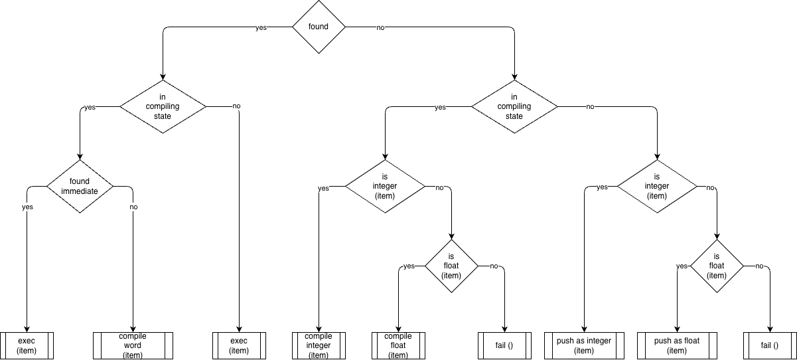
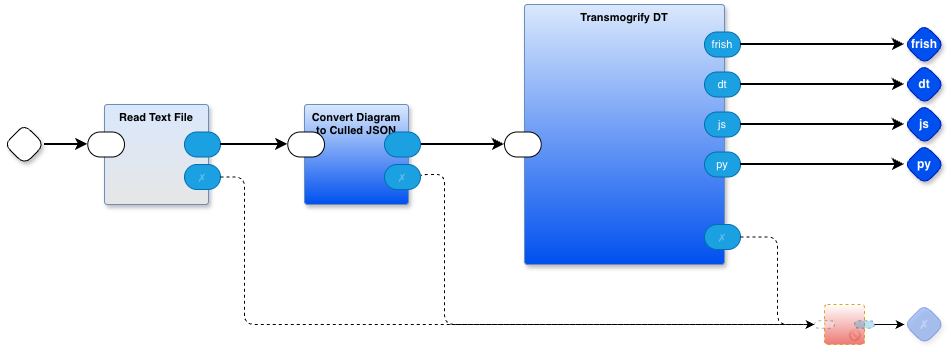
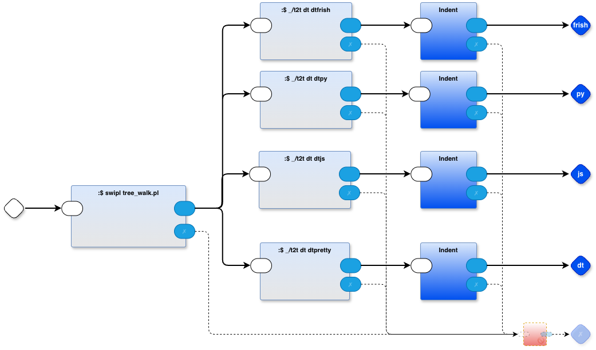

# dtree
decision tree diagram --> python (and JS, and a pseudo-language called "frish")



use the generated code as a snippet of code to be inserted into a python program

```
if found:
    if incompilingstate:
        if foundimmediate:
            return exec(item)
        else:
            return compileword(item)
        
    else:
        return exec(item)
    
else:
    if incompilingstate:
        if isinteger(item):
            return compileinteger(item)
        else:
            if isfloat(item):
                return compilefloat(item)
            else:
                return fail()
            
        
    else:
        if isinteger(item):
            return pushasinteger(item)
        else:
            if isfloat(item):
                return pushasfloat(item)
            else:
                return fail()
```

# usage
## top level
`./@install` (first time only)
`@make`
## as a sub-project
`@make <$1> <$2> <$3>`
- $1 is callee's working dir
- $2 is basename of the caller's file to be processed
- $3 is caller's working dir
- processes a drawing specified by `$2.drawio` and creates `$2.frish`, `$2.dt`, `$2.py`, `$2.js` in callee's working dir

# generated code
see the following files:
- example_frish.frish
- example_frish.dt
- example_py.py
- example_js.js

This project is meant to be a "one off" tools that helps write code for inclusion in other projects. 

As such, I haven't bothered to parameterize the build process (@make and @makec). My use-case needed only the `frish` code.

I modified the build to also create `.py` and `.js` to show that this idea can be used for other target languages. Each use-case needs a slightly different syntax for the text contained in the diagram, e.g. the python version needs to specify code snippets in Python syntax, the JavaScript version needs to use javascript snippets, etc.

The source code for the tool is itself a diagram (a PBP diagram, not a dtree diagram). You can look at the top level of the source by opening `dtree-transmogrifier.drawio` in the drawio editor (drawio.com - I use the downloaded app) and clicking on the various tabs. Each diagrammatic code part has a corresponding tab in the drawio editor. 



PBP is a hybrid language which uses, both, diagrams and text code. Text code parts have names that don't correspond to any of the tabs in the `.drawio` file. PBP, also, uses a special syntax `:$ ...` to shell out to bash script (shelling out could be optimized away, but, shelling out is so ridiculously fast on modern machines that it's not worth the bother. This is but a development _tool_, not production code, so the emphasis is on quick and easy). The synax `:$ _/t2t dt dtfrish` is internally rewritten to be `:$ ./pbp/t2t dt dtfrish` which ends up shelling out to the `t2t` bash script in the `./pbp` subdirectory (included). `_/t2t ... ...` is the main workhorse for the code generators. The first arg is the grammar file, the second arg is the rewrite rule file.

The front end of the generator (everything up to `:$ swipl tree_walk.pl` in the `Transmogrify DT` tab), is common to all code generators. The output of the front end is a little text language - intermediate code - that is used by each of the four generators `dtfrish`, `dtpy`, `dtjs` and `dtpretty` to generate code specific to each target language.



For expository purposes, I save out the `frish` version of the `.dt` IR to the file `example_frish.dt`.

Each of the four code generators uses the `T2T` tools (included in the repo). Generation consists of two main steps:
1. inhale and parse the IR using `OhmJS`. You can browse the grammar rules by loading the `.ohm` files into a programming editor.
2. transmogrify the IR code into code destined for each target language using `.rwr` (ReWRite, a little DSL (also written in OhmJS)). You can browse the rewrite rules by loading the `.rwr` files into a programming text editor.

Note, also, that the final step in the front end `:$ swipl tree_walk.pl` uses the SWI Prolog compiler. The `tree_walk.pl` code does some inferencing which could have been done using any more popular language containing loops, but, Prolog syntax is better for this kind of thing -- and -- the point was to make this tool easy and quick to build.

# Video Playlist

A playlist of short videos can be found at https://www.youtube.com/playlist?list=PLHh2_dCKBPjYhpvWSvJNJdrsZE8lNHza7.

The first video is an overview (about 1 minute). The rest of the videos show how I reworked the DPL code (Diagrammatic Programming Language) to be "more readable".

Note that the videos were made before I refactored the transmogrifier to also emit Python and Javascript. The final code `dtree-transmogrifier.drawio` is a bit different than the code shown in the videos.

# miscellaneous

The generated frish code is, later, peephole optimized in the `frish` project. `Dtree` is used as a sub-project in the `frish` project.
